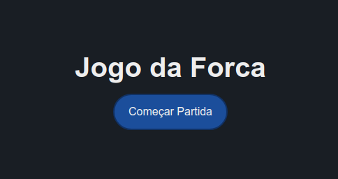
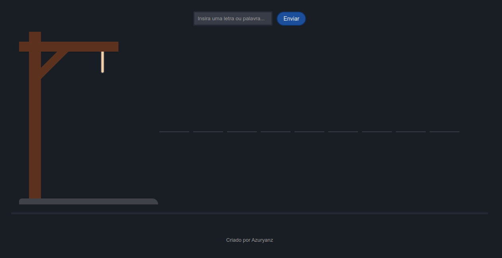
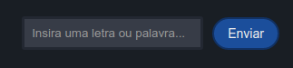
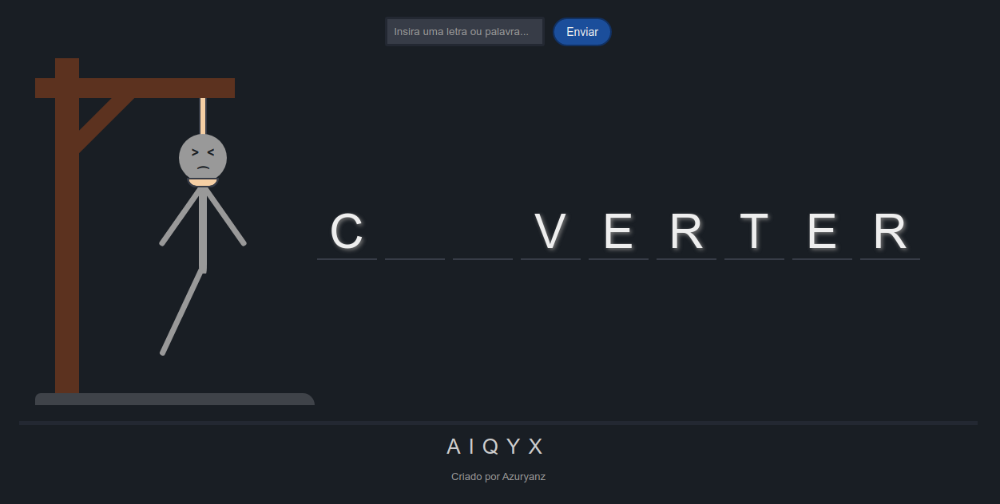
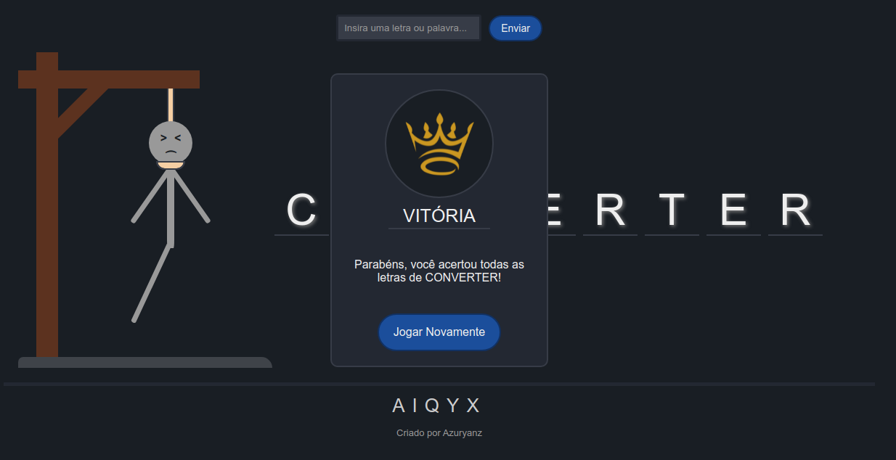
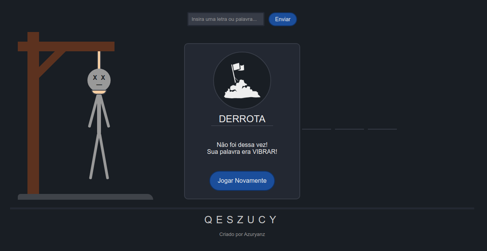

<h1 align="center">Jogo da Forca</h1>

## Sobre o Projeto
Todo o **HTML**, **CSS** e **JavaScript** foi desenvolvido por conta própria, apenas levando em conta as funcionalidades originais do jogo.

## Como utilizar

### Abrindo o arquivo
Uma vez que o projeto utiliza apenas de HTML, CSS e JavaScript, basta o usuário abrir o arquivo **index.html** em um navegador, que o jogo será carregado.

### Tela Inicial

Uma vez começado o jogo, quatro elementos aparecerão em tela:
- A aŕea da forca.
- Os espaços das letras da palavra
- O cemitério de letras.
- A área de input.

Para este projeto, foram geradas 300 palavras aleatórias, contidas no arquivo **palavras.js**. A palavra escolhida em cada rodada é aleatória.

### Área de Input

O usuário joga através da caixa de texto representada pela *imagem acima*. Para jogar, basta o usuário digitar **uma letra** ou a **palavra** que acha ser a resposta, e então *clicar* no botão de **Enviar** ou *pressionar* a **tecla enter** em seu teclado.

Enquanto o usuário estiver digitando apenas **letras únicas**, três coisas podem acontecer:

- Se a letra **pertencer** a palavra escolhida, **todas as suas repetições** (incluindo letras com acentuação) serão exibidas em suas devidas posições.
- Se a letra **não fizer parte** da palavra escolhida, ela será exibida no **cemitério de letras**, e o **personagem do jogador** começa a aparecer na forca.
- Se a letra já foi utilizada anteriormente, nada acontece.

Por fim, uma vez que o usuário tentar **adivinhar** a palavra, apenas dois resultados são possíveis:
- O jogador **acerta** a palavra e ganha a rodada.
- O jogador **erra** a palavra e perde a rodada.

 

### Ganhando o Jogo

Se o jogador adivinhar corretamente **todas** as letras da palavra, ou adivinhar a pŕopria palavra, ele alcança a vitória.

Para começar uma nova rodada, com uma outra palavra, basta clicar no botão **Jogar Novamente**.

### Perdendo o Jogo

Se o jogador errar uma letra um **total de sete vezes**, ou errar a palavra ao adivinhar, ele perde o jogo. No card de resultado ao fim da rodada, a palavra escolhida será exibida.

Para começar uma nova rodada, com uma outra palavra, basta clicar no botão **Jogar Novamente**.
